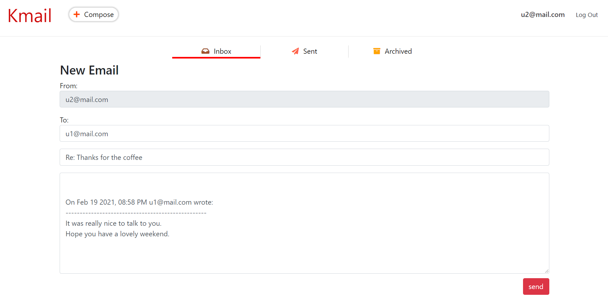

# Mail
An email web application which allows users to send, receive, and archive emails.
Using Python and Django framework at the backend; JavaScript, Html, CSS at the fromend. 

## Demo

### Inbox:

### Compose:

### Reply:

### Sent:

### Archive:

